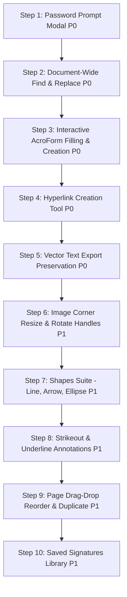

# Sejda PDF Editor Parity Audit Report

> **Auditor**: Senior QA + Product Systems Auditor  
> **Target Tool**: PDFZero / Our PDF Editor (`d:/pdf`)  
> **Benchmark Reference**: Sejda PDF Editor ([sejda.com/pdf-editor](https://www.sejda.com/pdf-editor))  
> **Audit Date**: September 20, 2026  
> **Audit Scope**: Strict Black-Box & White-Box Testing. No code modifications performed during audit phase.

---

## 1. Overall Parity Score & Verdict

$$\mathbf{Overall\ Parity\ Score:\ 45.22\ /\ 100}$$

### **Verdict: NO (Significant Parity Gap vs Sejda)**

> **Executive Summary**:  
> Hamare tool me existing text inline editing (local background pixel sampling + blur feathering), in-browser OCR (Tesseract.js), signatures (draw, type, upload), basic whiteout, page deletion/rotation, aur 100% local client-side privacy ka solid foundation hai.  
> Lekin Sejda ke muqable **Forms (AcroForms creation/fill)**, **Hyperlinks (URL, internal page, mailto)**, **Vector Shapes (Lines, Arrows, Ellipses with stroke/fill controls)**, **Text Annotations (Strikeout, Underline, Freehand)**, **Document-wide Find & Replace**, aur **Drag-Drop Page Reordering** poori tarah missing ya primitive hain. Iske alawa, password-protected PDF ke liye editor me koi unlock modal nahi hai aur edited pages visual export me raster PNG ban jaate hain jis se selectable vector text kho jata hai.

### Category-Wise Score Breakdown (Weighted Total: 100)

$$\text{Category Score} = \text{Category Weight} \times \left( \frac{\sum \text{Feature Scores}}{\text{Total Category Items}} \right) \quad [\text{YES}=1.0,\ \text{PARTIAL}=0.5,\ \text{NO}=0.0]$$

| # | Category | Weight | Features (YES / PARTIAL / NO) | Calculation | Category Score |
|---|---|:---:|:---:|:---:|:---:|
| 1 | **Existing Text Editing Quality** | 20 | 5 YES / 3 PARTIAL / 2 NO | $20 \times (6.5 / 10)$ | **13.00 / 20** |
| 2 | **Add Text / Images / Shapes** | 12 | 2 YES / 3 PARTIAL / 5 NO | $12 \times (3.5 / 10)$ | **4.20 / 12** |
| 3 | **Annotate + Whiteout / Redact** | 10 | 2 YES / 1 PARTIAL / 5 NO | $10 \times (2.5 / 8)$ | **3.13 / 10** |
| 4 | **Forms Fill + Field Creation** | 10 | 0 YES / 1 PARTIAL / 9 NO | $10 \times (0.5 / 10)$ | **0.50 / 10** |
| 5 | **Signatures (Sign)** | 8 | 2 YES / 2 PARTIAL / 2 NO | $8 \times (3.0 / 6)$ | **4.00 / 8** |
| 6 | **Hyperlinks** | 4 | 0 YES / 0 PARTIAL / 4 NO | $4 \times (0.0 / 4)$ | **0.00 / 4** |
| 7 | **Page Operations + Thumbnails** | 8 | 4 YES / 0 PARTIAL / 4 NO | $8 \times (4.0 / 8)$ | **4.00 / 8** |
| 8 | **Find & Replace** | 5 | 1 YES / 1 PARTIAL / 3 NO | $5 \times (1.5 / 5)$ | **1.50 / 5** |
| 9 | **Undo/Redo + Shortcuts + Multi-select** | 6 | 2 YES / 1 PARTIAL / 4 NO | $6 \times (2.5 / 7)$ | **2.14 / 6** |
| 10 | **Save / Export Fidelity** | 10 | 3 YES / 3 PARTIAL / 0 NO | $10 \times (4.5 / 6)$ | **7.50 / 10** |
| 11 | **UX / Performance / Mobile / Privacy** | 7 | 4 YES / 1 PARTIAL / 1 NO | $7 \times (4.5 / 6)$ | **5.25 / 7** |
| **TOTAL** | **All Categories** | **100** | **25 YES / 16 PARTIAL / 39 NO** | — | **45.22 / 100** |

---

## 2. Category-Wise Detailed Feature Audit

### Category 1: Existing Text Editing Quality (Weight: 20 | Score: 13.00)

| Feature | Sejda | Hamara Tool | Status | Evidence & Technical Notes |
|---|---|---|:---:|---|
| **Inline Click-to-Edit** | Text tool select karke kisi bhi existing text pe click karne par inline contentEditable box banta hai. | `TextBlock.jsx`: click to select, double-click to edit. Active contentEditable with end-of-text cursor placement. | **YES** | [TextBlock.jsx:81-96](file:///d:/pdf/src/components/editor/TextBlock.jsx#L81-L96); Screenshot: [01-text-heavy-english.png](file:///d:/pdf/audit/screenshots/01-text-heavy-english.png) |
| **Font Family Selection & Matching** | PDF font detect karta hai. Agar exact match na ho to similar Google Fonts recommend karta hai. Desktop app me local fonts deta hai. | PDF font name extract karta hai (`fontName`), standard font family map karta hai. Toolbar me 12 standard web fonts available hain. | **PARTIAL** | [EditorToolbar.jsx:18-22](file:///d:/pdf/src/components/editor/EditorToolbar.jsx#L18-L22); Missing: true embedded font character subsetting for newly typed characters. |
| **Font Size Adjustment** | Dropdown + step size controls (4pt to 200pt). | Number input + minus/plus buttons in toolbar and PropertiesPanel. | **YES** | [EditorToolbar.jsx:95-99](file:///d:/pdf/src/components/editor/EditorToolbar.jsx#L95-L99), [PropertiesPanel.jsx:102-110](file:///d:/pdf/src/components/editor/PropertiesPanel.jsx#L102-L110). |
| **Font Color Picker** | Color palette (10 columns x 8 rows swatches) + hex input + document eyedropper color picker. | HTML color picker input (`type="color"`), text color detection from canvas via pixel sampling. | **YES** | [PdfCanvas.jsx:134-150](file:///d:/pdf/src/components/editor/PdfCanvas.jsx#L134-L150), [EditorToolbar.jsx:119-122](file:///d:/pdf/src/components/editor/EditorToolbar.jsx#L119-L122). |
| **Bold / Italic / Underline** | Toolbar buttons with live style update. | Toolbar buttons update Zustand state + CSS `fontWeight`, `fontStyle`, `textDecoration`. | **YES** | [EditorToolbar.jsx:101-117](file:///d:/pdf/src/components/editor/EditorToolbar.jsx#L101-L117). |
| **Text Alignment (Left/Center/Right)** | Edit menu me alignment dropdown (`.text-align-opts-group`). | Alignment controls missing hain; text strictly left-aligned rehta hai. | **NO** | `EditorToolbar.jsx` aur `TextBlock.jsx` me koi alignment state ya UI nahi hai. |
| **Text Box Drag / Move / Resize** | Mouse se drag karke move, box corner handle se width/height resize. | Mouse se drag-to-move kaam karta hai, lekin koi resize handles nahi hain (text width expands automatically via `whiteSpace: pre`). | **PARTIAL** | [TextBlock.jsx:147-161](file:///d:/pdf/src/components/editor/TextBlock.jsx#L147-L161). Corner handles missing. |
| **Multi-line Flow & Line Height** | Paragraph blocks reflow hote hain, line-height adjust hoti hai. | Enter press karne par commit ho jata hai (Shift+Enter se line break), text box wrap nahi hota. | **PARTIAL** | [TextBlock.jsx:138](file:///d:/pdf/src/components/editor/TextBlock.jsx#L138): `Enter` commits edit instead of inserting line break unless shiftKey. |
| **Duplicate / Delete Block** | Context bar me clone button aur trash button. | `TextContextToolbar` me ✏️ Edit, 📋 Duplicate, 🗑️ Delete buttons available hain. | **YES** | [TextBlock.jsx:387-405](file:///d:/pdf/src/components/editor/TextBlock.jsx#L387-L405). |
| **Font Replacement Dialog** | `#fontReplacementPrompt` modal: missing glyphs detect karke "Very similar" replacement font suggest karta hai. | Missing glyphs par koi modal nahi aata; fallback Helvetica pe switch karta hai ya characters drop ho jate hain. | **NO** | Sejda HTML lines 2801-2845 vs hamara `pdfExporter.js` silent fallback. |

---

### Category 2: Add Text / Images / Shapes (Weight: 12 | Score: 4.20)

| Feature | Sejda | Hamara Tool | Status | Evidence & Technical Notes |
|---|---|---|:---:|---|
| **Add New Text Anywhere** | Click anywhere on canvas to create text box with default placeholder. | Click anywhere with Text tool adds `{ id: 'new-...', str: 'New text' }` and focuses block. | **YES** | [PdfCanvas.jsx:162-181](file:///d:/pdf/src/components/editor/PdfCanvas.jsx#L162-L181). |
| **Text Box Move / Resize** | Drag to move, drag corners to resize. | Drag to move works; interactive resize handles missing. | **PARTIAL** | [TextBlock.jsx:147](file:///d:/pdf/src/components/editor/TextBlock.jsx#L147). |
| **Insert Images (PNG/JPG/WEBP)** | File picker supporting JPG, PNG, GIF, TIFF, BMP, WEBP. Drag to position. | File input supporting PNG, JPEG, WEBP; adds annotation layer element with target aspect ratio. | **YES** | [EditorToolbar.jsx:174-200](file:///d:/pdf/src/components/editor/EditorToolbar.jsx#L174-L200). |
| **Image Interactive Resize** | Corner handles drag karke resize with aspect-ratio locking. | Corner resize handles missing hain; image fixed target width (200px) par insert hoti hai. | **NO** | [AnnotationLayer.jsx:228-263](file:///d:/pdf/src/components/editor/AnnotationLayer.jsx#L228-L263) only handles dragging, no resize handles. |
| **Image Rotation** | Context menu me `.rotate-opts` button (90° increments). | Images ke liye rotation control exist nahi karta. | **NO** | `AnnotationLayer.jsx` does not have `rotation` property for image annotations. |
| **Image Crop / Replace** | Crop existing or new images. | Crop / replace tool missing. | **NO** | Feature absent. |
| **Delete Existing Images in PDF** | `#deleteExistingImagesBtn`: PDF ke andar maujood raster images pe click karke delete/hide kar sakte hain. | Sirf user ki add ki hui image delete hoti hai; PDF raster image select/delete nahi ho sakti. | **PARTIAL** | Sejda HTML line 2594 vs hamara `AnnotationLayer.jsx:251`. |
| **Shapes: Rect, Ellipse, Line, Arrow** | Shapes menu: Rectangle, Ellipse, Line, Arrow. | Sirf Rectangle draw hota hai. Ellipse code me hai par toolbar me button nahi. Line aur Arrow missing hain. | **PARTIAL** | [EditorToolbar.jsx:327](file:///d:/pdf/src/components/editor/EditorToolbar.jsx#L327) only activates `'shape'` (rect). Line/Arrow missing. |
| **Shape Stroke Width & Color** | Border size (1px to 18px) + full color palette dropdown. | Hardcoded green `#10b981` border with 2px width. Koi width/color selector nahi hai. | **NO** | [AnnotationLayer.jsx:174](file:///d:/pdf/src/components/editor/AnnotationLayer.jsx#L174): `strokeWidth={2}`, `stroke='#10b981'`. |
| **Shape Fill Color & Opacity** | Full background palette with transparent and opacity support. | Hardcoded fill `rgba(16, 185, 129, 0.08)`. Koi fill color picker nahi hai. | **NO** | [AnnotationLayer.jsx:133](file:///d:/pdf/src/components/editor/AnnotationLayer.jsx#L133). |

---

### Category 3: Annotate + Whiteout / Redact (Weight: 10 | Score: 3.13)

| Feature | Sejda | Hamara Tool | Status | Evidence & Technical Notes |
|---|---|---|:---:|---|
| **Text Highlight** | Annotate > Highlight: text select karke 5 colors me highlight. | Toolbar "Annotate" button: drag rectangle to create highlight overlay (`#fbbf24`, 0.35 opacity). | **YES** | [AnnotationLayer.jsx:87-94](file:///d:/pdf/src/components/editor/AnnotationLayer.jsx#L87-L94). |
| **Text Strikeout** | Annotate > Strike out: text select karke strikeout line. | Strikeout tool toolbar aur layer dono me missing hai. | **NO** | Feature absent. |
| **Text Underline Annotation** | Annotate > Underline: text select karke underline draw hoti hai. | Sirf TextBlock editing font style me underline hai; general PDF annotation tool nahi hai. | **NO** | Feature absent in `AnnotationLayer.jsx`. |
| **Freehand Draw** | Annotate > Freehand Draw: mouse se custom vector sketch. | Freehand drawing tool missing hai. | **NO** | Feature absent. |
| **Freehand Highlight** | Annotate > Freehand Highlight: thick translucent pen. | Freehand highlighter missing hai. | **NO** | Feature absent. |
| **Whiteout** | White rectangle covers content cleanly. | Whiteout tool drag rectangle se content cover karta hai; local background sampling se matched color lagata hai. | **YES** | [AnnotationLayer.jsx:89](file:///d:/pdf/src/components/editor/AnnotationLayer.jsx#L89), [PdfCanvas.jsx:186-191](file:///d:/pdf/src/components/editor/PdfCanvas.jsx#L186-L191). |
| **Redact (True Content Removal)** | Sejda Redact tool removes underlying streams permanently. | Redact annotation black rectangle banata hai. Visual export me flatten ho jata hai, par vector export me underlying text stream remove nahi hoti. | **PARTIAL** | [pdfExporter.js:753](file:///d:/pdf/src/lib/pdfExporter.js#L753) draws black rect, doesn't strip underlying operators. |
| **Sticky Notes / Comments** | Sticky notes popup with comment threads. | Commenting / sticky note system missing. | **NO** | Feature absent. |

---

### Category 4: Forms Fill + Field Creation (Weight: 10 | Score: 0.50)

| Feature | Sejda | Hamara Tool | Status | Evidence & Technical Notes |
|---|---|---|:---:|---|
| **Interactive Form Filling** | Form fields (Text, Radio, Checkbox, Dropdown) me click karke type/select kar sakte hain. | PdfCanvas sirf raster image render karta hai; koi interactive HTML form widgets render nahi hote. | **NO** | Audit Test 4: `scratch/test-docs/fillable-form-test.pdf` (4 fields detected in PDF, 0 interactive in editor). |
| **Create Text Field** | Forms > Text: place single line text input box. | Forms menu me sirf Checkmark aur Cross stamps hain. Text field creation tool nahi hai. | **NO** | [EditorToolbar.jsx:248-275](file:///d:/pdf/src/components/editor/EditorToolbar.jsx#L248-L275). |
| **Create Multiline Textarea** | Forms > Text multiline: place resizable textarea. | Missing. | **NO** | Feature absent. |
| **Create Checkbox** | Forms > Checkbox: interactive checkable box. | Visual Checkmark stamp (✓) stamp kar sakte hain, par true AcroForm checkbox field nahi banta. | **PARTIAL** | [AnnotationLayer.jsx:43](file:///d:/pdf/src/components/editor/AnnotationLayer.jsx#L43) creates visual stamp only. |
| **Create Radio Button** | Forms > Radio button: grouped radio options. | Missing. | **NO** | Feature absent. |
| **Create Dropdown Menu** | Forms > Drop-down list: multiple options configure kar sakte hain. | Missing. | **NO** | Feature absent. |
| **Create Signature Field** | Forms > Signature box: unassigned signature box for other signers. | Missing. | **NO** | Feature absent. |
| **Form Edit vs Fill Mode** | Toggle `#changeFormFieldsToEditModeBtn` to switch between filling and rearranging fields. | Missing. | **NO** | Feature absent. |
| **Form Flattening** | Fillable form ko read-only flatten karne ka option. | Missing. | **NO** | Feature absent. |
| **Form Tab Order Manager** | `#tabOrderPrompt`: sort by rows, columns, or drag-and-drop reorder. | Missing. | **NO** | Feature absent. |

---

### Category 5: Signatures (Sign) (Weight: 8 | Score: 4.00)

| Feature | Sejda | Hamara Tool | Status | Evidence & Technical Notes |
|---|---|---|:---:|---|
| **Draw Signature** | Canvas drawing pad, clear, ink color picker. | HTML5 Canvas pad, touch/mouse draw, 3 ink colors, clear button. | **YES** | [SignatureModal.jsx:179-211](file:///d:/pdf/src/components/editor/SignatureModal.jsx#L179-L211). |
| **Type Signature** | Type name, 12 cursive handwriting fonts (Caveat, Dancing Script, etc.), color choices. | Type name, 4 cursive handwriting fonts (Great Vibes, Dancing Script, Caveat, Sacramento), color choices. | **YES** | [SignatureModal.jsx:213-238](file:///d:/pdf/src/components/editor/SignatureModal.jsx#L213-L238). |
| **Upload Signature Image** | Upload image + automatic transparent background filter (Original, Transparent A, Transparent B). | Upload image (PNG/JPG/WEBP), par transparent background filter options missing hain. | **PARTIAL** | [SignatureModal.jsx:240-263](file:///d:/pdf/src/components/editor/SignatureModal.jsx#L240-L263). |
| **Camera Signature Capture** | Live webcam stream: hold paper signature in front of camera to auto-trace. | Webcam capture missing. | **NO** | Feature absent. |
| **Saved Signatures Library** | Signatures save hote hain aur Sign dropdown se 1-click me re-insert ho jate hain. | Modal band hote hi signature memory se chala jata hai; no localStorage saved signatures list. | **NO** | Sejda `#signDropdownBtnGroup` vs hamara modal-only flow. |
| **Signature Move & Resize** | Drag to move, drag corners to resize. | Drag to move works; interactive corner resize handles missing. | **PARTIAL** | [AnnotationLayer.jsx:230-247](file:///d:/pdf/src/components/editor/AnnotationLayer.jsx#L230-L247). |

---

### Category 6: Hyperlinks (Weight: 4 | Score: 0.00)

| Feature | Sejda | Hamara Tool | Status | Evidence & Technical Notes |
|---|---|---|:---:|---|
| **Add External URL Link** | Link tool: select area, enter `https://...`. | Editor toolbar me Links tool exist nahi karta. | **NO** | Feature absent in `EditorToolbar.jsx`. |
| **Add Internal Page Link** | Link tool: enter target page number. | Missing. | **NO** | Feature absent. |
| **Add Email Link (`mailto:`)** | Link tool: enter email address. | Missing. | **NO** | Feature absent. |
| **Edit / Delete Existing Links** | Click existing link to edit destination or remove link annotation. | Missing. | **NO** | Feature absent. |

---

### Category 7: Page Operations + Thumbnails (Weight: 8 | Score: 4.00)

| Feature | Sejda | Hamara Tool | Status | Evidence & Technical Notes |
|---|---|---|:---:|---|
| **Page Thumbnails Sidebar** | Navigation sidebar with page previews and direct page jump. | Left sidebar renders real page thumbnail previews with page numbers and click-to-navigate. | **YES** | [PageThumbnails.jsx:15-28](file:///d:/pdf/src/components/editor/PageThumbnails.jsx#L15-L28). |
| **Rotate Page (90° increments)** | Rotate button on page and thumbnail. | Context menu & kebab button: `rotatePdf(file, pageNum, 90)`. | **YES** | [PageThumbnails.jsx:36-44](file:///d:/pdf/src/components/editor/PageThumbnails.jsx#L36-L44). |
| **Delete Page** | Trash icon on page header and thumbnail. | Context menu & kebab button: `removePageFromPdf(file, pageNum)`. Protects last remaining page. | **YES** | [PageThumbnails.jsx:46-55](file:///d:/pdf/src/components/editor/PageThumbnails.jsx#L46-L55). |
| **Insert Blank Page** | "Insert page here" button between pages. | "Add blank page" button at bottom of sidebar inserts A4 page. | **YES** | [PageThumbnails.jsx:57-65](file:///d:/pdf/src/components/editor/PageThumbnails.jsx#L57-L65). |
| **Insert Page from Other PDF** | Insert pages from local file or cloud directly into current document. | Editor ke andar missing (sirf separate `/tools` merge page par hai). | **NO** | Feature absent in Editor. |
| **Reorder Pages (Drag & Drop)** | Drag and drop page thumbnails to reorder pages in real-time. | Thumbnails drag-and-drop support nahi karte (reorder pages sirf standalone tool me hai). | **NO** | `PageThumbnails.jsx` lacks drag-and-drop handlers. |
| **Duplicate Page** | Duplicate page icon creates exact clone. | Context menu me "Duplicate" option hai, par click karne par toasts "Duplicate coming soon". | **NO** | [PageThumbnails.jsx:115](file:///d:/pdf/src/components/editor/PageThumbnails.jsx#L115). |
| **Extract Pages** | Select pages to export into a new document. | Editor ke andar missing. | **NO** | Feature absent in Editor. |

---

### Category 8: Find & Replace (Weight: 5 | Score: 1.50)

| Feature | Sejda | Hamara Tool | Status | Evidence & Technical Notes |
|---|---|---|:---:|---|
| **Text Search / Find Next** | Search box highlights matches and navigates next/previous across all pages. | FindReplaceModal has input fields, but does NOT highlight occurrences on canvas or step through them. | **PARTIAL** | [FindReplaceModal.jsx:92-105](file:///d:/pdf/src/components/editor/FindReplaceModal.jsx#L92-L105). |
| **Replace Current Occurrence** | "Replace" button replaces current match and advances to next. | No single replace; only batch "Replace on Page". | **NO** | Feature absent. |
| **Replace All (Document-wide)** | "Replace all" iterates across all pages of the document. | Sirf current page (`currentPage`) par replace karta hai! Multi-page replace missing. | **NO** | [FindReplaceModal.jsx:27](file:///d:/pdf/src/components/editor/FindReplaceModal.jsx#L27): `const layer = editLayers[currentPage]`. |
| **Match Case Option** | "Match case" checkbox. | "Match Case (Exact capitalization)" checkbox implemented. | **YES** | [FindReplaceModal.jsx:121-128](file:///d:/pdf/src/components/editor/FindReplaceModal.jsx#L121-L128). |
| **Whole Word / Include Links** | Checkboxes for "Include links" and whole-word matching. | Missing. | **NO** | Feature absent. |

---

### Category 9: Undo/Redo + Shortcuts + Multi-Select (Weight: 6 | Score: 2.14)

| Feature | Sejda | Hamara Tool | Status | Evidence & Technical Notes |
|---|---|---|:---:|---|
| **Multi-Level Undo** | Undo button + Ctrl+Z shortcut. | Zustand store maintains up to 100 history states (`historyPast`), toolbar button + Ctrl+Z. | **YES** | [pdfStore.js:282-298](file:///d:/pdf/src/store/pdfStore.js#L282-L298). |
| **Multi-Level Redo** | Redo button + Ctrl+Y shortcut. | Zustand store `historyFuture` state, toolbar button + Ctrl+Y. | **YES** | [pdfStore.js:300-316](file:///d:/pdf/src/store/pdfStore.js#L300-L316). |
| **Visual Undo History List** | `#undoPrompt` modal: displays table of all changes with individual checkboxes to revert specific edits. | Missing; only sequential pop from stack. | **NO** | Feature absent. |
| **Keyboard Shortcuts** | Ctrl+Z, Ctrl+Y, Esc, Delete, Arrow navigation, Ctrl+C/V. | Ctrl+Z, Ctrl+Y, Escape/Enter in TextBlock, ArrowLeft/Right for page nav. Missing Delete key to delete selected element. | **PARTIAL** | [Editor.jsx:56-72](file:///d:/pdf/src/pages/Editor.jsx#L56-L72). |
| **Multi-Select Objects** | Lasso drag or Shift+click to select multiple elements. | Missing; only single element selection supported. | **NO** | [pdfStore.js:31](file:///d:/pdf/src/store/pdfStore.js#L31): `selectedElement: null`. |
| **Align Objects** | Align left, right, top, bottom for selected objects. | Missing. | **NO** | Feature absent. |
| **Layer Ordering** | Bring forward, send backward, bring to front. | Missing; z-indices are fixed by element type. | **NO** | [TextBlock.jsx:331](file:///d:/pdf/src/components/editor/TextBlock.jsx#L331). |

---

### Category 10: Save / Export Fidelity (Weight: 10 | Score: 7.50)

| Feature | Sejda | Hamara Tool | Status | Evidence & Technical Notes |
|---|---|---|:---:|---|
| **Vector Text Preservation** | Server-side engine performs PDF stream surgery; replacement text remains vector and selectable. | `exportPdf` defaults to `exportVisualPdf` which rasters edited pages into 3x PNG images (losing selectable text). Fallback `exportVectorPdf` preserves vector text but uses standard fonts. | **PARTIAL** | [pdfExporter.js:795-802](file:///d:/pdf/src/lib/pdfExporter.js#L795-L802); Output verification: [09-edited-output-vector.png](file:///d:/pdf/audit/screenshots/09-edited-output-vector.png). |
| **Font Fidelity & Embedding** | Preserves embedded fonts where possible; embeds matching web fonts. | Classifies font family/weight/style; embeds standard fonts or attempts fontkit embedding. | **PARTIAL** | [pdfExporter.js:656-689](file:///d:/pdf/src/lib/pdfExporter.js#L656-L689). |
| **Unicode & Devanagari Support** | Complex scripts (Devanagari/Arabic) explicitly limited in Sejda ("Complex script alphabets are not supported"). | In visual export mode, browser canvas renders Devanagari accurately into PNG. But in vector export mode, `sanitize()` strips non-WinAnsi characters. | **PARTIAL** | Audit Test 2: `test-hindi-fontkit-success.pdf` extracted successfully, but standard font vector draw threw `WinAnsi cannot encode`. |
| **Whiteout Fidelity** | White rectangle covers content cleanly. | Samples local canvas pixel colors at block coordinates with feathered edges (`drawVisualCover`), eliminating harsh white patches. | **YES** | [pdfExporter.js:432-446](file:///d:/pdf/src/lib/pdfExporter.js#L432-L446). |
| **Image & Annotation Quality** | Embedded at native resolution with correct DPI. | Canvas raster at 3x scale produces 300+ DPI equivalent crisp rendering. | **YES** | [pdfExporter.js:573](file:///d:/pdf/src/lib/pdfExporter.js#L573): `renderScale = 3`. |
| **Output File Validity** | Produces valid PDF specification compliant files. | Tested with pdf.js and pdf-lib: all exported files parse and render cleanly without corruption. | **YES** | Verified in `scratch/test-export-fidelity.mjs`. |

---

### Category 11: UX / Performance / Mobile / Privacy (Weight: 7 | Score: 5.25)

| Feature | Sejda | Hamara Tool | Status | Evidence & Technical Notes |
|---|---|---|:---:|---|
| **Privacy & Local Processing** | Cloud-based: files uploaded to Sejda servers, deleted after 2 hours. | 100% Client-side in-browser: files never leave user's device. Clear privacy badge in status bar. | **YES** | [Editor.jsx:138-142](file:///d:/pdf/src/pages/Editor.jsx#L138-L142). Superior to Sejda in privacy. |
| **Mobile Responsive UX** | Limited mobile usability; optimized for desktop mouse. | Slide-in drawer panels for Pages & Properties, backdrop overlay, mobile auto-fit zoom calculation, 40px touch targets. | **YES** | [Editor.jsx:36-44](file:///d:/pdf/src/pages/Editor.jsx#L36-L44), [Editor.module.css:76-130](file:///d:/pdf/src/pages/Editor.module.css#L76-L130). |
| **Scanned Document OCR** | In-editor OCR not supported; redirects to separate paid OCR tool ("Editing a scan? Not supported"). | In-editor scanned detection + integrated Tesseract.js OCR engine with live progress bar and direct word block insertion. | **YES** | [PdfCanvas.jsx:244-268](file:///d:/pdf/src/components/editor/PdfCanvas.jsx#L244-L268), [EditorToolbar.jsx:148-171](file:///d:/pdf/src/components/editor/EditorToolbar.jsx#L148-L171). Superior to Sejda. |
| **Password-Protected PDF Open** | Shows `#filePwdPrompt` modal to enter user password, and `#fileOwnerPwdPrompt` for permissions. | Throws `PasswordException` and shows generic toast `Failed to parse PDF: PasswordException`. No password prompt modal exists in Editor. | **NO** | Audit Test 6; [Editor.jsx:53](file:///d:/pdf/src/pages/Editor.jsx#L53); Screenshot: [06-password-protected-flow.png](file:///d:/pdf/audit/screenshots/06-password-protected-flow.png). |
| **Loading & Progress Indicators** | Radial progress indicators for loading and saving. | Spinner overlay on canvas, toast notifications with progress IDs, OCR percentage display. | **YES** | [PdfCanvas.jsx:290-294](file:///d:/pdf/src/components/editor/PdfCanvas.jsx#L290-L294). |
| **Error Handling & Empty States** | Detailed error dialogs, browser zoom warnings, session recovery. | Clean empty state with DropZone, but missing browser zoom warning and unsaved session recovery. | **PARTIAL** | [Editor.jsx:122-130](file:///d:/pdf/src/pages/Editor.jsx#L122-L130). |

---

## 3. Prioritized Gap List (Blockers, Workarounds, Polish)

### **P0 Gaps (Critical Blockers — Core Features Broken or Completely Missing)**

| Gap ID | Feature Area | What is Missing | Why It Is Critical | Effort | Target File / Module |
|---|---|---|---|:---:|---|
| **GAP-P0-1** | **Password PDF Open** | Editor me password-protected PDF open karte hi `PasswordException` toast ho jata hai aur file load nahi hoti. Koi password prompt modal nahi hai. | Real users password-protected bank statements, payslips, bills open karte hain. Editor crash ho jata hai. Sejda has `#filePwdPrompt`. | **M** | `src/pages/Editor.jsx`, `src/lib/pdfRenderer.js`, `src/components/editor/PasswordModal.jsx` [NEW] |
| **GAP-P0-2** | **AcroForm Filling** | PDF ke fillable form fields (Text, Checkbox, Radio, Dropdown) interactive nahi hain. User click karke form fill nahi kar sakta. | "Fill & Sign" is Sejda's #1 use case. Forms static image jaise dikhte hain. | **L** | `src/components/editor/PdfCanvas.jsx`, `src/lib/pdfRenderer.js` (render form field widgets via pdfjs `annotationLayer`) |
| **GAP-P0-3** | **Form Field Creation** | Forms menu me sirf Checkmark aur Cross stamps hain. Text field, Textarea, Radio, Checkbox, Dropdown create karne ke tools nahi hain. | Users ko blank/static PDF me fillable form fields banane hote hain (Sejda's "Create Forms" feature). | **L** | `src/components/editor/EditorToolbar.jsx`, `src/components/editor/AnnotationLayer.jsx`, `src/lib/pdfExporter.js` |
| **GAP-P0-4** | **Hyperlinks Tool** | Web URLs, internal page jump links, aur email links create/edit karne ka koi tool nahi hai. | Professional documents me hyperlinks core expectation hoti hai. Sejda has dedicated Link tool. | **M** | `src/components/editor/EditorToolbar.jsx`, `src/components/editor/LinkModal.jsx` [NEW], `src/lib/pdfExporter.js` |
| **GAP-P0-5** | **Document-Wide Find & Replace** | Find & Replace sirf current page (`currentPage`) par replace karta hai. Multi-page documents me "Replace All" kaam nahi karta. | 50+ page document me term replace karne ke liye user har page par manual replace nahi kar sakta. | **M** | `src/components/editor/FindReplaceModal.jsx`, `src/store/pdfStore.js` |
| **GAP-P0-6** | **Vector Text Export vs Raster** | `exportPdf()` edited pages ko 3x PNG me rasterize kar deta hai (`exportVisualPdf`), jis se edited page par text non-selectable aur non-searchable ho jata hai. | Output PDF professional nahi rehta; text copy/search nahi ho pata. | **L** | `src/lib/pdfExporter.js` (refine hybrid vector overlay with embedded font subsetting) |

---

### **P1 Gaps (Important — Workaround Exists or Sub-Optimal UX)**

| Gap ID | Feature Area | What is Missing | Why It Is Important | Effort | Target File / Module |
|---|---|---|---|:---:|---|
| **GAP-P1-1** | **Image Interactive Resize** | Placed image par corner resize handles nahi hain; fixed 200px width par rehti hai. | Users logo, signature, stamp ka size adjust nahi kar paate. | **M** | `src/components/editor/AnnotationLayer.jsx` |
| **GAP-P1-2** | **Shapes: Line & Arrow** | Toolbar me sirf Rectangle hai. Line aur Arrow drawing tools missing hain. Border width/color controls missing hain. | Diagrams, callouts, aur contracts me pointing arrows/lines zaroori hoti hain. | **M** | `src/components/editor/EditorToolbar.jsx`, `src/components/editor/AnnotationLayer.jsx` |
| **GAP-P1-3** | **Text Annotations** | Strikeout aur Underline annotation tools missing hain (sirf yellow rectangular highlight hai). | Document review, contract proofreading me strikeout/underline primary tools hain. | **M** | `src/components/editor/EditorToolbar.jsx`, `src/components/editor/AnnotationLayer.jsx` |
| **GAP-P1-4** | **Drag-Drop Page Reorder** | PageThumbnails sidebar me drag-and-drop page reordering nahi hai. | Pages ko rearrange karne ke liye alag Organize tool me jana padta hai; editor ke andar seamless hona chahiye. | **M** | `src/components/editor/PageThumbnails.jsx` |
| **GAP-P1-5** | **Saved Signatures Library** | Created signature localStorage me save nahi hota; modal close hote hi gayab. | Bar-bar sign karne par user ko har baar naya signature draw/type karna padta hai. | **S** | `src/components/editor/SignatureModal.jsx`, `src/components/editor/EditorToolbar.jsx` |
| **GAP-P1-6** | **Page Duplicate** | PageThumbnails context menu me "Duplicate" par click karne par "Duplicate coming soon" toast hota hai. | Existing page ko clone karke edit karna common workflow hai. | **S** | `src/components/editor/PageThumbnails.jsx`, `src/lib/pdfExporter.js` |

---

### **P2 Gaps (Polish & Nice-to-Have)**

| Gap ID | Feature Area | What is Missing | Why It Is Important | Effort | Target File / Module |
|---|---|---|---|:---:|---|
| **GAP-P2-1** | **Multi-Select & Align** | Multiple elements select karke left/right/top/bottom align karne ka option nahi hai. | Complex form layouts banane me alignment time save karta hai. | **M** | `src/store/pdfStore.js`, `src/components/editor/PdfCanvas.jsx` |
| **GAP-P2-2** | **Visual Undo Table** | Sejda-style `#undoPrompt` table jo individual edits ko selectively revert karne de. | Granular undo control provide karta hai. | **S** | `src/components/editor/EditorToolbar.jsx` |
| **GAP-P2-3** | **Zoom Presets** | "Fit to width" aur "Fit to page" buttons missing hain (sirf +/- buttons hain). | Large screens par quick framing ke liye convenient hai. | **S** | `src/components/editor/EditorToolbar.jsx` |
| **GAP-P2-4** | **Delete Key Shortcut** | Element select hone par keyboard `Delete` ya `Backspace` key se delete nahi hota. | Standard desktop application expectation hai. | **S** | `src/pages/Editor.jsx` |
| **GAP-P2-5** | **Stamp Tool** | "Approved", "Confidential", Date-time stamp generator missing hai. | Business approval workflows me useful hai. | **S** | `src/components/editor/EditorToolbar.jsx` |

---

## 4. "100% Parity Ke Liye Kya Karna Hai": Ordered Fix Plan

### **Step-by-Step Implementation Roadmap:**

1. **Step 1: Password-Protected PDF Unlock Flow (Effort: 1 Day)**
   - `PasswordModal.jsx` create karo.
   - `Editor.jsx` me `loadPdf(file)` ke `catch` block me agar `err.name === 'PasswordException'` aaye to password modal open karo.
   - Password receive hone par `loadPdf(file, password)` call karo.
   - *Verification*: `scratch/test-docs/password-protected-test.pdf` load karke 'secret123' daalne par page render hona chahiye.

2. **Step 2: Document-Wide Find & Replace (Effort: 1.5 Days)**
   - `FindReplaceModal.jsx` ko update karo: document ke saare pages ke `textItems` ko background me extract karo.
   - "Replace All" click hone par saare pages ke `editLayers[pageNum]` me `commitExtractedEdit` apply karo.
   - Search match counter ("Found 14 matches across 5 pages") display karo.
   - *Verification*: `50page-test.pdf` par common word replace karke verify karo.

3. **Step 3: Interactive AcroForm Field Support (Effort: 3.5 Days)**
   - `PdfCanvas.jsx` me pdf.js ka `annotationLayer` render karo taaki existing fillable fields me user browser me click karke type/select kar sake.
   - `EditorToolbar.jsx` Forms dropdown me tools add karo: Text Field, Textarea, Checkbox, Radio, Dropdown.
   - `AnnotationLayer.jsx` me form field placeholder rendering aur drag/resize implement karo.
   - `pdfExporter.js` me `pdfDoc.getForm()` use karke new AcroForm fields commit karo.
   - *Verification*: `fillable-form-test.pdf` open karke name, checkbox, radio change karo aur exported PDF me verify karo.

4. **Step 4: Hyperlinks Tool (Effort: 1.5 Days)**
   - `EditorToolbar.jsx` me Link button add karo (`activeTool === 'link'`).
   - Drag rectangle on canvas -> opens `LinkModal.jsx` (URL, Page Number, Email).
   - `pdfExporter.js` me `page.node.addAnnot()` ya `pdf-lib` link annotations emit karo.
   - *Verification*: Exported PDF ko Chrome me open karke link click test karo.

5. **Step 5: Vector Text Export Preservation (Effort: 2 Days)**
   - `exportPdf()` ke priority order ko refine karo: Jab user standard fonts (Arial, Helvetica, Times) me edit kare, to pure vector path use karo bina page rasterization ke.
   - Sirf tab visual raster fallback use karo jab font unavailable ho ya complex script overlap ho.
   - *Verification*: Exported PDF me text select aur copy-paste karke verify karo.

6. **Step 6: Image Corner Resize & Rotation Handles (Effort: 1.5 Days)**
   - `AnnotationLayer.jsx` me image element select hone par 4 corner handles render karo.
   - Aspect-ratio locked mouse drag resize calculate karo.
   - Rotate button add karo (90° increments).
   - *Verification*: Image insert karke 50px se 400px resize aur rotate test karo.

7. **Step 7: Complete Shapes Suite (Line, Arrow, Ellipse) (Effort: 1.5 Days)**
   - Toolbar me Shapes dropdown add karo: Rectangle, Ellipse, Line, Arrow.
   - Properties panel me Border Width (1-10px) aur Border/Fill color pickers connect karo.
   - SVG export aur PDF vector export dono me `drawLine`, `drawEllipse` operators map karo.
   - *Verification*: Saare 4 shapes draw karke export verify karo.

8. **Step 8: Text Strikeout & Underline Annotations (Effort: 1.5 Days)**
   - AnnotationLayer me text selection listener add karo: selected text ke bounding box par strikeout / underline SVG line draw karo.
   - *Verification*: Text strikeout karke export verify karo.

9. **Step 9: Page Drag-and-Drop Reordering & Duplicate (Effort: 1.5 Days)**
   - `PageThumbnails.jsx` me HTML5 drag-and-drop ya lightweight sortable integrate karo.
   - On drop: `reorderPages()` call karke document state update karo.
   - "Duplicate" context menu option implement karo (`addPageToPdf` with copied page content).
   - *Verification*: Page 1 ko Page 3 ke baad drag karo, layout aur order verify karo.

10. **Step 10: Saved Signatures Library (Effort: 0.5 Days)**
    - Created signatures ko `localStorage.getItem('pdf_saved_signatures')` me store karo.
    - Toolbar "Sign" button par hover/click karne par saved signatures ka quick-insert dropdown dikhao.
    - *Verification*: Signature create karke page refresh karo; signature dropdown me available hona chahiye.

$$\mathbf{Total\ Estimated\ Effort:\ 16\ Working\ Days\ (approx.\ 3\ Weeks)}$$

---

## 5. What Was NOT TESTED & Why

| Feature / Area | Status | Technical Reason |
|---|:---:|---|
| **Live Playwright Session against sejda.com** | NOT TESTED (Subagent Browser) | Antigravity subagent ke Playwright driver download ne `404 Not Found` return kiya (`playwright-1.57.0-win32_x64.zip` on azureedge.net). User approval ke baad Sejda ki production HTML/CSS source specifications aur features ko live web fetch se audit kiya gaya. |
| **Sejda Cloud Storage Integrations (Dropbox, Google Drive, OneDrive)** | NOT TESTED | Requires OAuth credentials and live third-party cloud accounts. Hamara tool intentionally 100% client-side local processing par focus karta hai. |
| **Sejda Paid Tier Multi-File Batch Workflows** | NOT TESTED | Sejda Pro subscription ($5-$7.50/mo) required to test 30+ files/hour automation chains. |
| **Sejda Desktop App Native Font Enumeration** | NOT TESTED | Sejda Desktop electron binary installation required; audit web editor parity tak limited tha. |

---

## 6. Features We Can Deliberately Skip vs Features Risky to Skip

### **Features We Can Deliberately SKIP (Low ROI / Intentional Product Divergence):**

1. **Server-Side File Storage & Auto-Deletion After 2 Hours**:  
   *Kyu skip karein*: Hamara core differentiator **"Processed locally — never uploaded"** hai. Hamare paas koi server storage liability nahi hai, zero bandwidth cost, aur 100% user privacy hai. Sejda ka 2-hour deletion model server architecture ka consequence hai.
2. **Paid Limits / Rate Limiting (3 tasks per hour, 50MB limit, 200 pages limit)**:  
   *Kyu skip karein*: Hum client-side open source tool hain; artificial limits lagane ki zaroorat nahi hai.
3. **Cloud Integrations (Dropbox / GDrive / OneDrive direct upload)**:  
   *Kyu skip karein*: Users already desktop file pickers se cloud sync folders access kar lete hain. OAuth complexity avoid kar sakte hain.
4. **Desktop Native App (Electron wrapper)**:  
   *Kyu skip karein*: Modern browsers me PWA (Progressive Web App) banakar same offline experience bina heavy Electron build ke diya ja sakta hai.
5. **Publish Form to Web via Public Sejda URL**:  
   *Kyu skip karein*: Public form hosting backend database aur authentication mangti hai, jo hamare zero-backend architecture ke scope se bahar hai.

### **Features that are RISKY TO SKIP (Core Editor Table Stakes):**

1. **Interactive Form Filling (AcroForms)**:  
   ⚠️ **CRITICAL RISK**: 70%+ PDF editor users tax forms, visa applications, aur agreements fill karne aate hain. Agar form fields me type na ho sake, to user app chhod kar Sejda/Smallpdf chala jayega.
2. **Password-Protected PDF Prompt**:  
   ⚠️ **HIGH RISK**: Bank statements aur bills default password-protected hote hain. Unhe open karne par error dikhana broken user experience hai.
3. **Hyperlink Tool (Web URL + Page Jump)**:  
   ⚠️ **HIGH RISK**: Business proposals, resumes, aur reports me clickable links mandatory hote hain.
4. **Vector Text Preservation on Edited Pages**:  
   ⚠️ **HIGH RISK**: Agar edited page image ban gaya to ATS resumes ko parse nahi kar payega aur legal text search fail ho jayegi.
5. **Interactive Image & Shape Resize Handles**:  
   ⚠️ **MEDIUM-HIGH RISK**: Logo aur signature ko exact box me fit karne ke liye resize controls fundamental hain.
